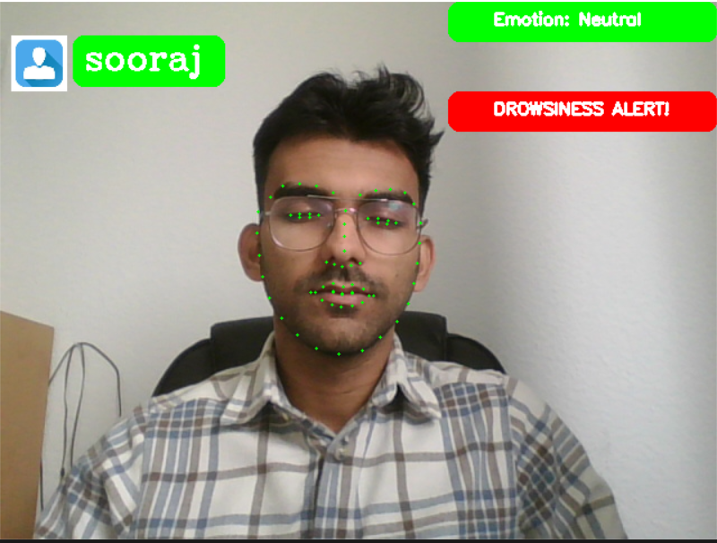
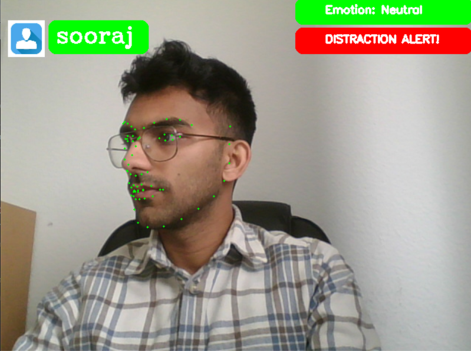
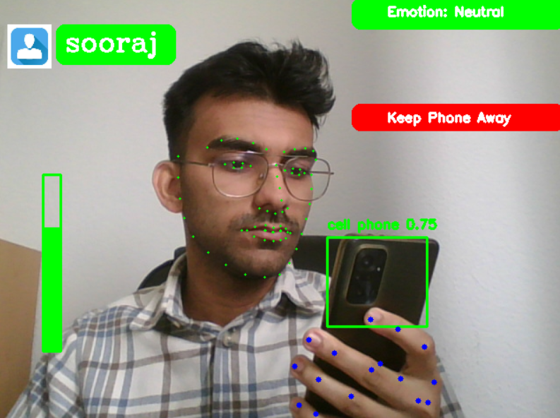
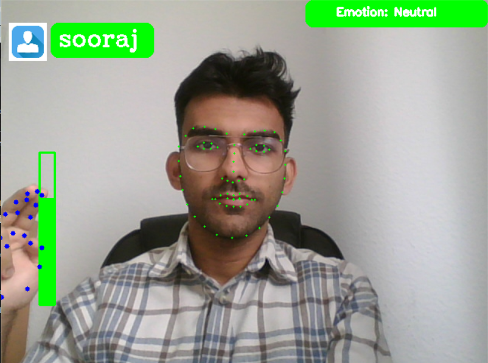

# In-Cabin Driver Monitoring System

This project is an advanced Driver Monitoring System that performs real-time face recognition, facial landmark detection, emotion recognition, eye aspect ratio calculation for drowsiness detection, head pose estimation for distraction detection, and hand gesture recognition for volume control. It also detects specific objects in the video stream, such as cell phones, using YOLO (You Only Look Once) for object detection. The key functionalities and how they are implemented are detailed below.

[GitHub Repository](https://github.com/soorajabraham1/Driver-Monitoring-System)

## Key Functionalities and Implementations

1. **Face Recognition and User Authentication**
    - **Description:** Identifies and authenticates users based on their facial features.
    - **Implementation:**
        - The system loads user images from a directory, encodes the faces using the `face_recognition` library, and stores these encodings.
        - During runtime, the system captures frames from the webcam and uses `face_recognition` to locate and encode faces in the current frame.
        - It compares the current frame's face encodings with the stored encodings to identify and authenticate users.
    

2. **Facial Landmark Detection and Eye Aspect Ratio (EAR) Calculation**
    - **Description:** Detects facial landmarks and calculates the eye aspect ratio to monitor drowsiness.
    - **Implementation:**
        - The system uses `dlib` to detect facial landmarks with a pre-trained shape predictor.
        - It extracts the coordinates of eye landmarks to compute the EAR, which helps in detecting if the user's eyes are closed for prolonged periods, indicating drowsiness.
        - If the EAR falls below a threshold for a certain number of consecutive frames, a drowsiness alert is triggered.
    - 

3. **Distraction Detection**
    - **Description:** Estimates the head pose to detect user distraction.
    - **Implementation:**
        - The project uses the `cv2.solvePnP` function to estimate the 3D pose of the user's head based on detected facial landmarks.
        - It calculates the pitch, yaw, and roll angles to determine if the user is looking away from the screen for an extended period, which triggers a distraction alert.
    - 

4. **Facial Expression Recognition**
    - **Description:** Recognizes the user's facial expressions and emotions.
    - **Implementation:**
        - A pre-trained model from `cv2.dnn` is used to predict facial expressions from the region of interest in the detected face.
        - The detected expression is displayed on the screen.

5. **Cell Phone Detection**
    - **Description:** Detects specific objects, such as cell phones, in the video stream to monitor and alert the user to keep away distractions.
    - **Implementation:**
        - The system loads the YOLO model and its configuration and class files.
        - It processes each frame through the YOLO network to detect objects.
        - If a cell phone is detected with high confidence, an alert is displayed.
        - 
6. **Hand Gesture Recognition for Volume Control**
    - **Description:** Controls the system volume based on hand gestures.
    - **Implementation:**
        - The project uses `mediapipe` to detect hand landmarks and track hand movements.
        - It calculates the vertical distance between the middle and index finger tips to adjust the system volume.
        - Volume changes are mapped to the distance moved by the hand gesture.
        - 
## Project Structure and File Descriptions

- **Main Script:** The main script initializes all models and variables, processes each frame from the webcam, and handles the main logic for face recognition, landmark detection, head pose estimation, and more.
- **Modules:**
    - `incabin_utils.py`: Contains utility functions for eye aspect ratio calculation, head pose estimation, and face encoding.
    - `Volume.py`: Contains the volume control logic based on hand gesture recognition.
    - `Ui.py`: Contains functions to create and manage user interface elements like overlays.
    - `Textbox.py`: Contains functions to draw custom-shaped text boxes on the video frame.

## Execution Flow

1. Initialize and load all necessary models and variables.
2. Start the webcam video stream.
3. For each frame:
    - Perform face recognition and user authentication.
    - Detect facial landmarks and calculate EAR for drowsiness detection.
    - Estimate head pose to check for user distraction.
    - Recognize facial expressions and display them.
    - Detect specific objects using YOLO and alert if necessary.
    - Recognize hand gestures to control volume.
    - Overlay UI elements and alerts on the video frame.
4. Display the processed frame.
5. Continue the loop until the user exits by pressing the 'q' key.

## Dependencies

- opencv-python
- dlib
- numpy
- face-recognition
- mediapipe
- scipy
- imutils

## Conclusion

This project combines various computer vision and machine learning techniques to provide a comprehensive system for user monitoring and interaction through a webcam. It detects and responds to multiple aspects such as user identity, attention, emotional state, and even hand gestures, making it suitable for applications requiring high levels of user engagement and monitoring.
